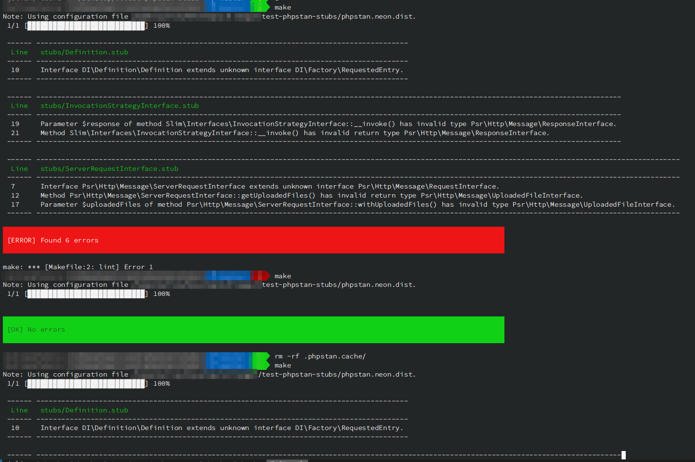

# PHPStan Stub example

* First run, PHPStan errors complaining about unknown classes and/or interfaces
* Second and subsequent runs, PHPStan does not complain anymore

You can repeat the cycle by changing phpstan config or removing .phpstan.cache directory

